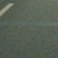
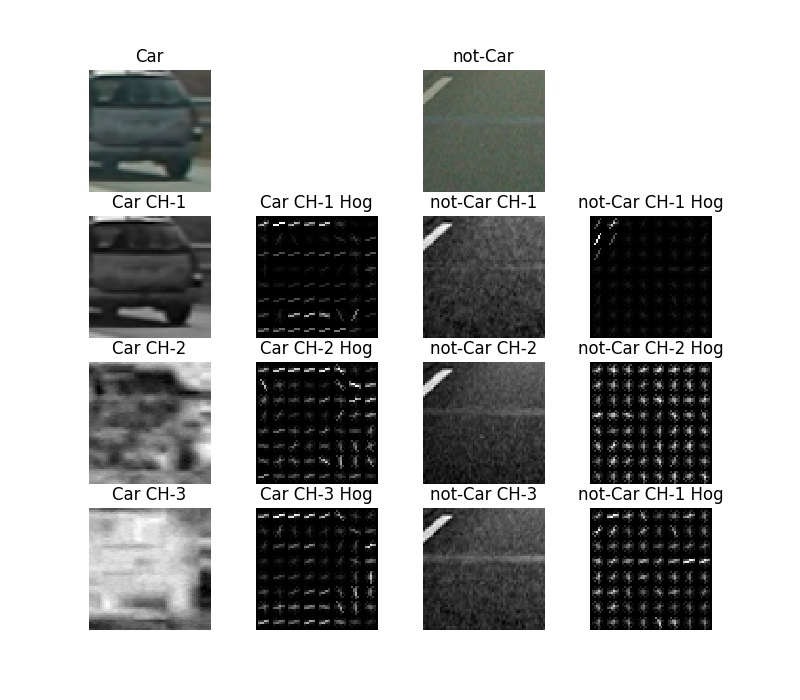
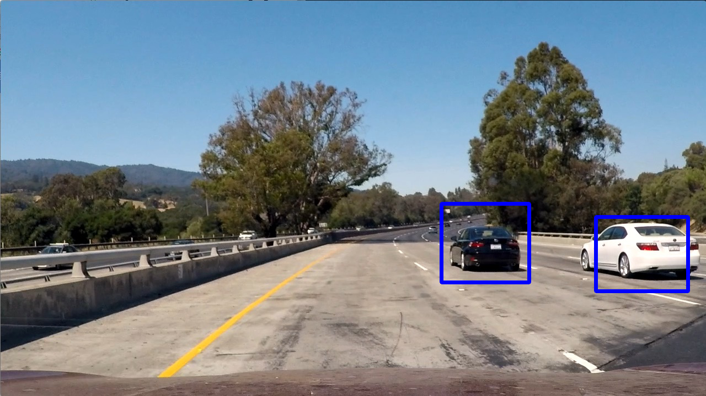
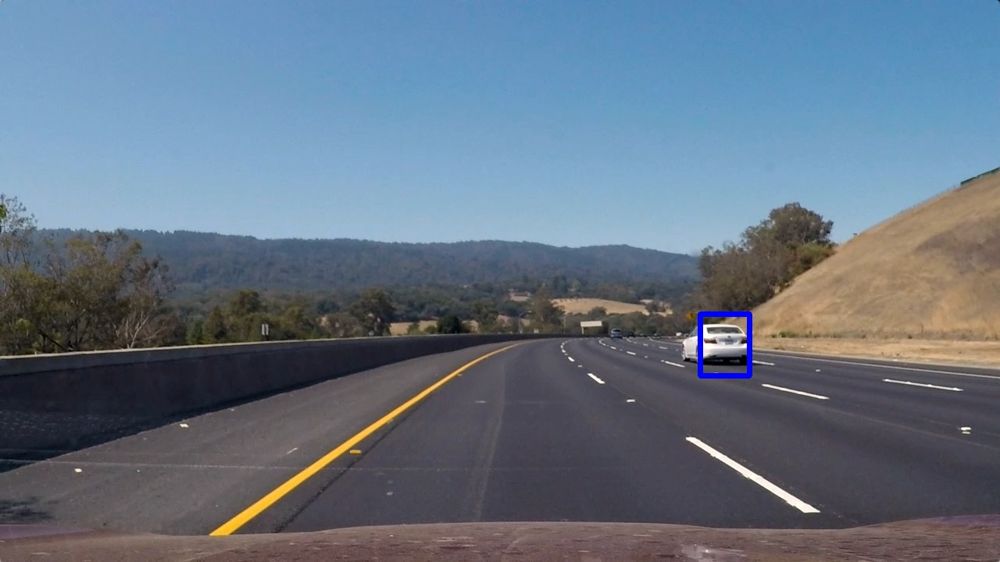
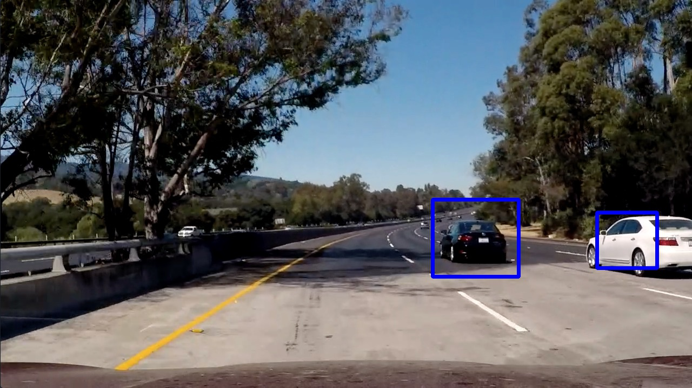
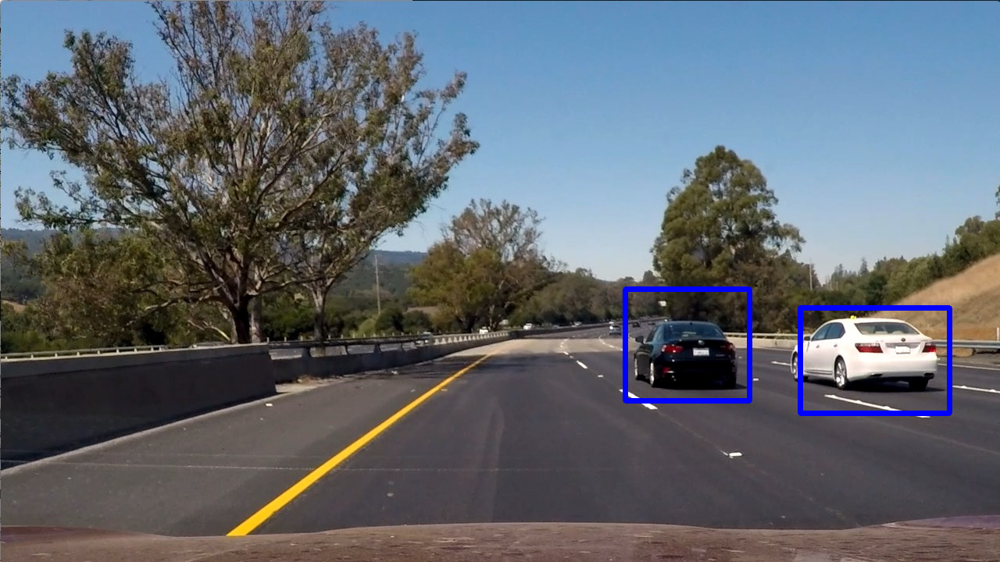
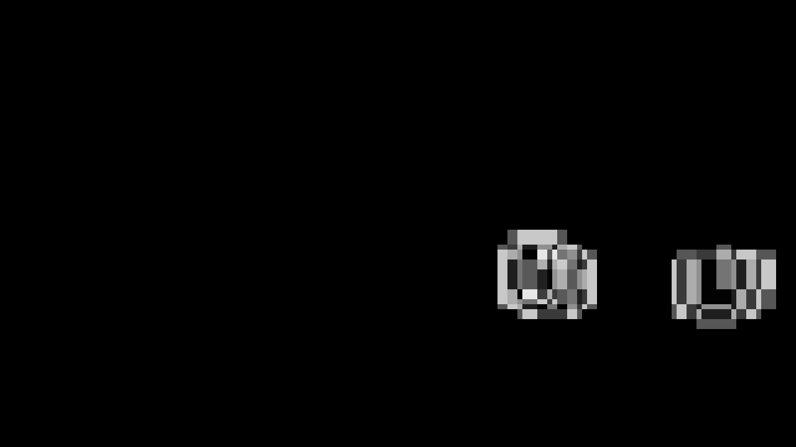
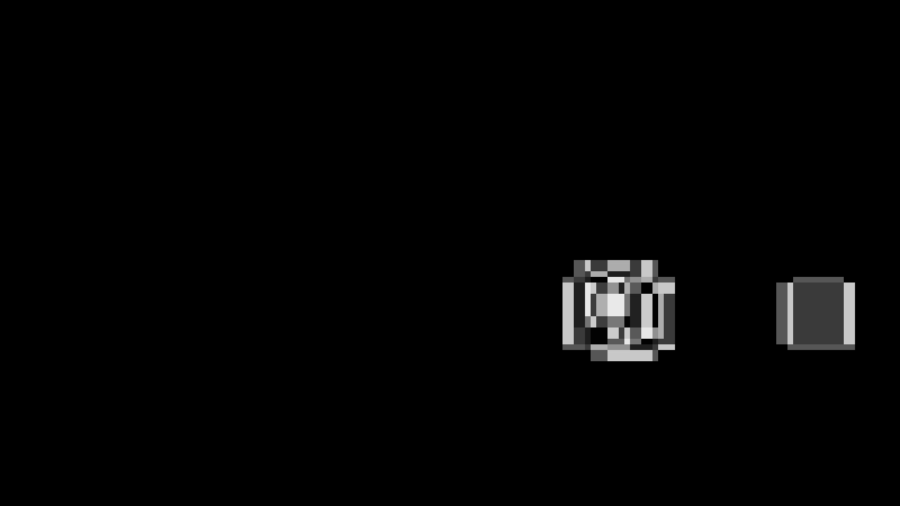

**Vehicle Detection Project**

The goals / steps of this project are the following:

* Perform a Histogram of Oriented Gradients (HOG) feature extraction on a labeled training set of images and train a classifier Linear SVM classifier
* Optionally, you can also apply a color transform and append binned color features, as well as histograms of color, to your HOG feature vector. 
* Note: for those first two steps don't forget to normalize your features and randomize a selection for training and testing.
* Implement a sliding-window technique and use your trained classifier to search for vehicles in images.
* Run your pipeline on a video stream (start with the test_video.mp4 and later implement on full project_video.mp4) and create a heat map of recurring detections frame by frame to reject outliers and follow detected vehicles.
* Estimate a bounding box for vehicles detected.

[//]: # (Image References)
[image2]: ./examples/HOG_example.jpg
[image3]: ./examples/sliding_windows.jpg
[image4]: ./examples/sliding_window.jpg
[image5]: ./examples/bboxes_and_heat.png
[image6]: ./examples/labels_map.png
[image7]: ./examples/output_bboxes.png
[video1]: ./project_video.mp4

## [Rubric](https://review.udacity.com/#!/rubrics/513/view) Points
### Here I will consider the rubric points individually and describe how I addressed each point in my implementation.

---
### Writeup / README

#### 1. Provide a Writeup / README that includes all the rubric points and how you addressed each one.  You can submit your writeup as markdown or pdf.  [Here](https://github.com/udacity/CarND-Vehicle-Detection/blob/master/writeup_template.md) is a template writeup for this project you can use as a guide and a starting point.

You're reading it!

### Histogram of Oriented Gradients (HOG)

#### 1. Explain how (and identify where in your code) you extracted HOG features from the training images.

The complete implementation is in the file [vehicle_detection.py](vehicle_detection.py). Any functions or line numbers referred to below are in that file unless stated otherwise.

The actual HOG features are computed in the [get_hog_features()](vehicle_detection.py#L29-L47) function, which is called (indirectly) by [predict_cars()](vehicle_detection.py#L210-L265), which loads the training images.

I started by reading in all the `vehicle` and `non-vehicle` images.  Here is an example of one of each of the `vehicle` and `non-vehicle` classes:

 
_Vehicle Image_

 
_Non-Vehicle Image_

I then explored different color spaces and different `skimage.hog()` parameters (`orientations`, `pixels_per_cell`, and `cells_per_block`).  Using the `YCrCb` color space, `orientations=9`, `pixels_per_cell=(8, 8)` and `cells_per_block=(2, 2)` appeared to give the best results when processing the test video.

Here is an example using the the above parameters: 

#### 2. Explain how you settled on your final choice of HOG parameters.

I tried various combinations of parameters but after selecting the YCrCb color space, I couldn't find better values for the other parameters than the above, which I believe are similar to those given in the course materials.

#### 3. Describe how (and identify where in your code) you trained a classifier using your selected HOG features (and color features if you used them).

I trained a linear SVM using `LinearSVC().fit(X_train, y_train)`, see [predict_cars()](vehicle_detection.py#L249-L255). As training data (X_train) and labels (y_train) a subset of the the labelled vehicles (label=1) and non-vehicles (label=0) were used. Features used were (as described above) HOG features for all the channels plus spatial features plus color histograms. The feature extraction is performed in [extract_features()](vehicle_detection.py#L70-L123).

### Sliding Window Search

#### 1. Describe how (and identify where in your code) you implemented a sliding window search.  How did you decide what scales to search and how much to overlap windows?

I searched the area 370<=y<656. For simplicity, the whole area was scanned for all the scales used, which were 1, 1.5, 2, 3.5 and 6, see [process_image_internal()](vehicle_detection.py#L305-L328). This is probably not optimal for performance, but didn't seem to be the cause of much false positives at least. I started with the Fibonacci sequence since the golden ratio appears "everywhere" in nature, then I tweaked the numbers by trial-and-error looking at the final output video and processing the test images.

#### 2. Show some examples of test images to demonstrate how your pipeline is working.  What did you do to optimize the performance of your classifier?

Ultimately I searched on five scales using YCrCb 3-channel HOG features plus spatially binned color and histograms of color in the feature vector, which provided a nice result. For each frame shown below, the detected windows are processed multiple times in these test images to "warm up the heatmap", since the heatmap accumulates values over time when run on the video. I implemented a very basic moving average where for each video frame, the previous heatmap is added to and then I multiply each heatmap pixel with 0.8. Here are some example images:

---

### Video Implementation

#### 1. Provide a link to your final video output.  Your pipeline should perform reasonably well on the entire project video (somewhat wobbly or unstable bounding boxes are ok as long as you are identifying the vehicles most of the time with minimal false positives.)
Here's a [link to my video result](./output_images/project_video_out.mp4).

#### 2. Describe how (and identify where in your code) you implemented some kind of filter for false positives and some method for combining overlapping bounding boxes.

I recorded the positions of positive detections in each frame of the video (across all the scales).  From the positive detections I created a heatmap and accumulated it into the current/previous heatmap, see [add_heat()](vehicle_detection.py#L268-L277) and then thresholded that map to identify vehicle positions.  I then used `scipy.ndimage.measurements.label()` to identify individual blobs in the heatmap, see [process_image_internal()](vehicle_detection.py#L305-L328).  I then assumed each blob corresponded to a vehicle.  I constructed bounding boxes to cover the area of each blob detected.

Here's an example result showing the heatmap from the test images, the result of `scipy.ndimage.measurements.label()` and the bounding boxes then overlaid on the frame:

### Here are four test images with heatmaps and their corresponding bounding boxes:

---

### Discussion

#### 1. Briefly discuss any problems / issues you faced in your implementation of this project.  Where will your pipeline likely fail?  What could you do to make it more robust?

After copy-pasting the code snippets from the course materials, the first stumbleblock was that I accidentally used different feature vectors for training and video frame processing. Total disaster ;-) Once I corrected that next problem was tuning the parameters. I ended up having either too many false positives or missing detections and "jittery" detections. Averaging the heatmaps across frames was required to resolve that. After further fine-tuning of the parameters I'm actually pretty happy with the output video.

In order to improve, I believe it would be useful to use [spatial transformer networks](http://torch.ch/blog/2015/09/07/spatial_transformers.html) to pre-process both the vehicle images as well as finding the exact location and correct scaling on the video frames. This would probably be horribly slow but could improve performance a lot.

The probably too simplistic averaging I did could be replaced with something smarter taking into account all the information in say the 10 most recent frames' heatmaps. Maybe that would result in better scores.
